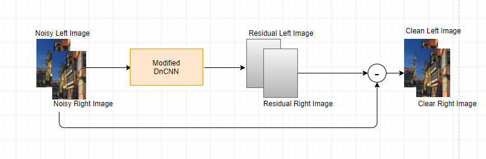

# A-CNN-based-Stereo-Image-Denoising-Method
This project is an implementation of a convolutional neural network denoising method for stereo image corrupted with AWGN. 

We model a noisy image as the sum of the clean imageand an additive white Gaussian noise (AWGN). And similarto DnCNN, our method adopts residual learning to esti-mate the additive noise and then obtains the clean image bysimply subtracting the estimated noise from the noisy image.Moreover, the mean squared error is adapted as a loss func-tion to learn the model’s parameters.Our  method  first  takes  two  grey  level  input  images  of  thesame sizelxwx1, wherelis the length andwis the width.It then stacks them into anlxwx2image where the right im-age is on the first channel and the left image is on the secondchannel. And this last image is going to be the one that entersthe convolutional neural network.

The implementation of this project was conducted on google colab and using google drive to store the data and the model. Therefore, in order test or train the network, the following steps are required;

1. Upload the directory Stereo-Pytorch-master on your google drive.

2. Upload the notebook Stereo-Image-Denoising.ipynb to google colab.

3. Follow the steps in the notebook for testing or training.

# Results

We compare our model to one non-local similarity based method (BM3D) and to one CNN based denoising methods (DnCNN-S). We comapre the methods on the noise levels 15, 25 and 35 as shown in table below. Although, for higher noise levels like 25 and 35 DnCNN-S out-performs our method with a relatively small gap of 0.6dB, our method out-performs DnCNN-S with a significant gap of 7.07dB on the noise level 15. In fact, as mentioned in the previous section; in addition to intra-views corralations, our method relays on inter-views correlations to extract the noisy pixels. However, when the noise level is high, inter-view correlations between the noisy pixels will also be high and this can negatively affect noise extraction. This also proves that inter-view correlations are very effective in noise extraction on low noise levels because the inter-view correlations between the noisy pixels is also low therefore the network will be able to identify them more easily. This can be illustrated by the performance of our model on the noise level 15.

|               |PSNRout/ SSIMout|PSNRout/ SSIMout|PSNRout/ SSIMout|PSNRout/ SSIMout|
| ------------- | ------------- | ------------  | ----------- |-------------|
| Noise Level   | PSNRin/ SSIMin| BM3D          | DnCNN-S     | Our Model   |                                      
| 15            | 24.60/ 0.5578 |  30.75/ 0.8928|23.68/ 0.5567|31.07/ 0.9461|
| 25            | 20.17/ 0.3791 |  27.94/ 0.8262|28.60/ 0.8342|28.10/ 0.9011|
| 35            | 17.24/ 0.2747 |  26.20/ 0.7682|27.1/ 0.7621 |26.49/ 0.8412|

